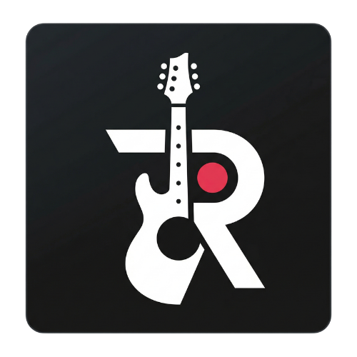

<div align="center">
  
  
  # Recoru
  
  **Akor Siteleri İçin Yerel Ses Kaydediciniz**
  
  [](https://chrome.google.com/webstore/detail/YOUR_EXTENSION_ID)
  [](https://opensource.org/licenses/MIT)
</div>

---

**Recoru**, hakoru.net ve repertuarim.com gibi akor sitelerinde sörf yaparken çaldığınız şarkıları anında kaydedip, tarayıcınızda güvence altında tutan, açık kaynak kodlu (Open Source) bir Chrome eklentisidir.

Hiçbir sunucuya bağlanmaz; tüm ses kayıtlarınız %100 yerel olarak cihazınızda (IndexedDB ile) saklanır. Gizliliğe tam saygı duyar!

## ✨ Özellikler

- **🎸 Otomatik Şarkı Tespiti:** Desteklenen akor sitelerinde çaldığınız şarkının adını ve sanatçısını otomatik olarak algılar.
- **🎙️ Tek Tıkla Kayıt:** Gelişmiş sekme içi mikrofon izni mimarisi (*Manifest V3 uyumlu*) sayesinde popup üzerinden anında kayıt alın.
- **📁 Yerel Depolama (Offline-First):** Kayıtlarınız `audio/webm;codecs=opus` formatında IndexedDB üzerinde tutulur. Buluta hiçbir şey gönderilmez.
- **🎧 Hızlı Dinleme:** Eskiden o şarkı için aldığınız tüm kayıtları listeleyin, anlık dinleyin ve yönetin.
- **🌙 Şık Koyu Tema:** Müzisyen dostu, göz yormayan modern arayüz (UI).

## 🚀 Desteklenen Siteler

| Platform | URL Formatı |
|----------|-------------|
| [Hakoru](https://www.hakoru.net) | `/akor/{sarki-ismi}` |
| [Repertuarım](https://www.repertuarim.com) | `/akor/{sarki-ismi}-akor-{id}.html` |

*Daha fazla sitenin eklenmesi için Issue açabilirsiniz!*

## 🛠️ Nasıl Kurulur? (Geliştirici Sürümü)

Eklentiyi Chrome Web Store'dan indirmek yerine kaynağını indirip kurmak isterseniz:

1. Bu repository'i indirin veya clone'layın: `git clone https://github.com/KULLANICI_ADINIZ/recoru.git`
2. Chrome tarayıcınızı açın ve adres çubuğuna şunu yazın: `chrome://extensions/`
3. Sağ üst köşeden **"Geliştirici Modu" (Developer Mode)** anahtarını açın.
4. Sol üstteki **"Paketlenmemiş öğe yükle" (Load unpacked)** butonuna tıklayın.
5. Klasör seçici penceresinden indirdiğiniz `recoru` klasörünü seçin.

Kurulum tamam! Sağ üstteki eklentiler ikonuna (yapboz parçası) tıklayıp Recoru'yu sabitleyebilirsiniz. 📌

## 💻 Geliştirme (Development)

Proje Vanilla JavaScript, HTML ve CSS ile herhangi bir framework/build aracı olmadan (Sıfır bağımlılık) yazılmıştır. Manifest V3 gereksinimleri (örneğin iframe injection ile `getUserMedia` izinleri) doğrultusunda özel bir mimariyle tasarlanmıştır.

### Klasör Yapısı
```
recoru/
├── manifest.json       # Eklentinin kalbi
├── popup.html/css/js   # Eklenti arayüzü ve kayıt dinleme mantığı
├── content.js          # Sayfa içi URL parse & Mikrofon iframe köprüsü
├── recorder.html/js    # Mikrofon izinlerini extension context'te alan gizli iframe
├── db.js               # IndexedDB veritabanı wrapper'i
└── assets/             # İkonlar ve resimler
```

### Katkıda Bulunma (Contributing)

Katkılarınızı sabırsızlıkla bekliyoruz! PR (Pull Request) veya Issue açarak projeye destek olabilirsiniz. Lütfen PR açmadan önce kodunuzu test etmeyi ve Manifest V3 kurallarına uyduğundan emin olmayı unutmayın.

## 📄 Gizlilik Politikası (Privacy Policy)

Recoru, %100 çevrimdışı çalışır. Mikrofonunuz **yalnızca siz kayıt düğmesine bastığınızda** etkinleşir. Kaydedilen ses dosyaları sadece tarayıcınızın kendi güvenli veritabanına (IndexedDB) yazılır ve dışarı bir ağa / veri tabanına asla aktarılmaz. Recoru analitik veya kullanıcı verisi toplamaz. Ek bilgi için: [Privacy Policy (EN)](privacy.html)

## 📜 Lisans

Bu proje [MIT](LICENSE) lisansı altında lisanslanmıştır. Dilediğiniz gibi çatallayıp kendi projelerinizde kullanabilirsiniz.
